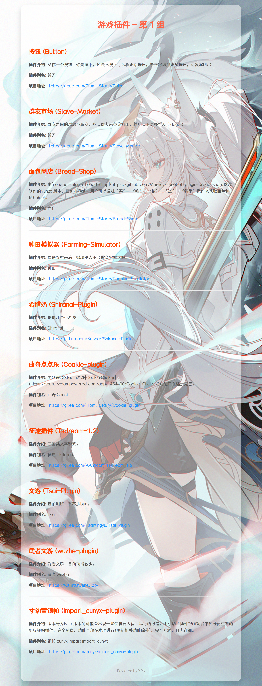

<h1 align="center">向日葵插件 · XRK-plugin</h1>

<p align="center">
  <strong>面向 <a href="https://github.com/sunflowermm/XRK-Yunzai">XRK-Yunzai</a> 的多功能消息插件</strong><br>
  帮助图 · 插件安装与管理 · 资源图 · 早报 · 抖音热榜/推荐 · 整点报时
</p>

<div align="center">

[](LICENSE)
[](https://github.com/sunflowermm/XRK-Yunzai)
[](package.json)

</div>

---

## 预览

### 主帮助

<p align="center">
  
</p>
<p align="center"><sub><code>#向日葵帮助</code></sub></p>

### 子帮助

<p align="center">
  
  
</p>
<p align="center"><sub>左：插件管理　右：全局表情</sub></p>

<p align="center">
  
  
</p>
<p align="center"><sub>左：刷步数　右：早报推送</sub></p>

<p align="center">
  
  
</p>
<p align="center"><sub>左：整点报时　右：主人管理</sub></p>

### 早报

<p align="center">
  
</p>
<p align="center"><sub><code>#早报</code></sub></p>

### 安装插件列表

<p align="center">
  
  
</p>
<p align="center"><sub>左：推荐　右：游戏 · <code>#安装插件列表</code></sub></p>

---

## 功能

| 分类 | 说明 |
|------|------|
| 帮助 | 主帮助与各功能帮助图 |
| 插件 | 查询、安装、启停、删除 |
| 资源图 | 随机图与关键词图 |
| 早报 | 今日早报；可定时推送到白名单群 |
| 抖音 | 热榜、推荐、热词视频（需 R 插件 Cookie；链接解析请用 R） |
| 其它 | 全局表情、偷图、刷步数、整点报时、天气、群文件等 |

---

## 环境要求

- [XRK-Yunzai](https://github.com/sunflowermm/XRK-Yunzai)（Node.js 24+）
- 使用抖音热榜/推荐时需安装 [rconsole-plugin](https://gitee.com/kyrzy0416/rconsole-plugin)，并在其 `config/tools.yaml` 配置 `douyinCookie`

---

## 安装

在 Yunzai 根目录执行（三选一）：

```bash
# Gitcode（国内）
git clone --depth=1 https://gitcode.com/Xrkseek/XRK-plugin.git plugins/XRK-plugin

# Gitee
git clone --depth=1 https://gitee.com/xrkseek/XRK-plugin.git plugins/XRK-plugin

# GitHub
git clone --depth=1 https://github.com/sunflowermm/XRK-plugin.git plugins/XRK-plugin
```

如有依赖提示，在框架根目录安装后重启：

```bash
pnpm add axios uuid form-data node-schedule -w
```

---

## 常用指令

| 类别 | 指令 |
|------|------|
| 帮助 | `#向日葵帮助` · `#插件相关帮助` · `#早报推送帮助` · `#全局表情帮助` … |
| 插件 | `#查插件` · `#安装插件列表` · `#安装插件名` · `#停用插件` / `#启用插件` |
| 随机图 | `#随机图片` · `#东方图` · `#cos图` · `#黑丝图` … |
| 早报 | `#早报` · `#今日早报` |
| 抖音 | `#抖音热榜` · `#抖音推荐` · `#抖音热词视频` |

更多指令见上方帮助图。

---

## License

<p align="center">
  <a href="LICENSE">MIT</a> © Sunflower Studio
</p>
