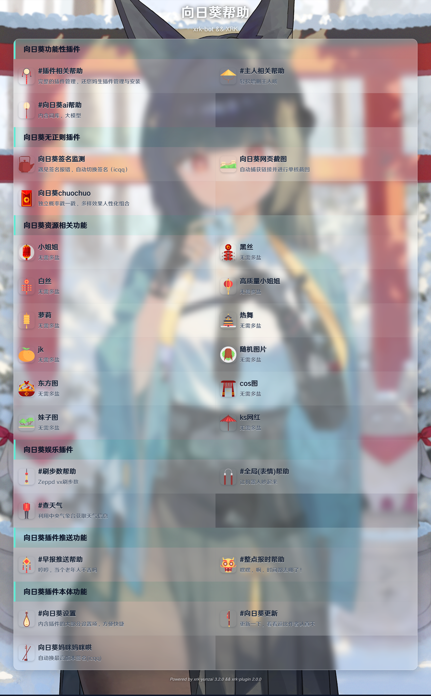
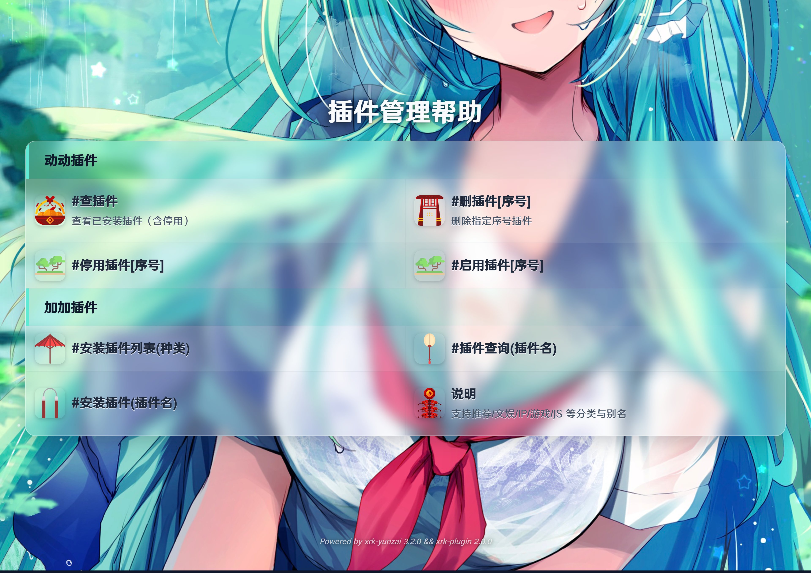
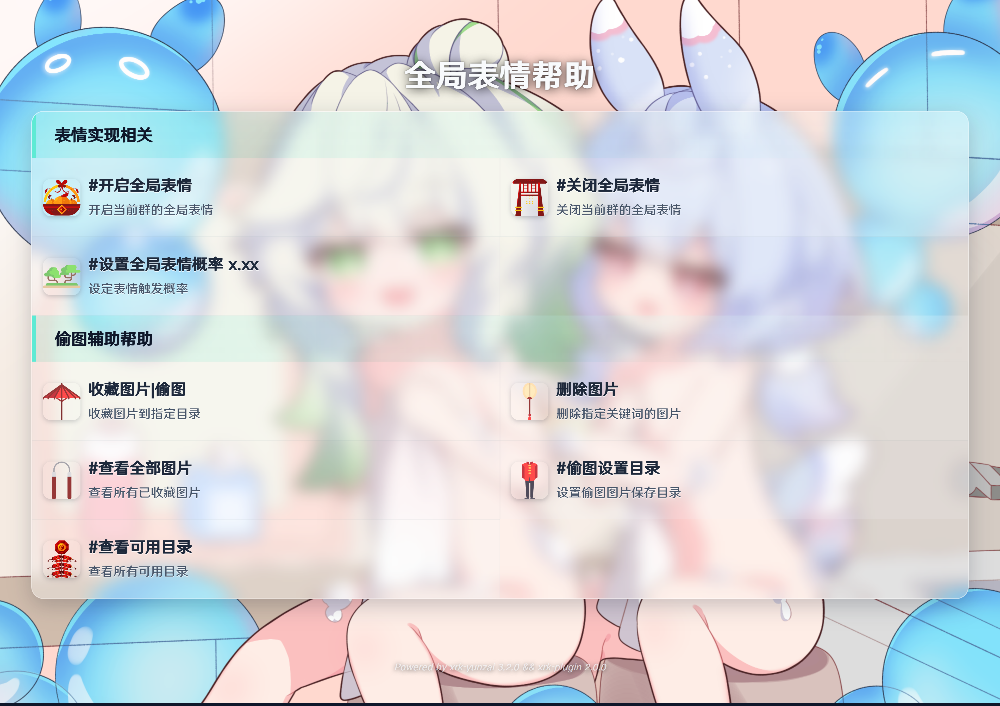
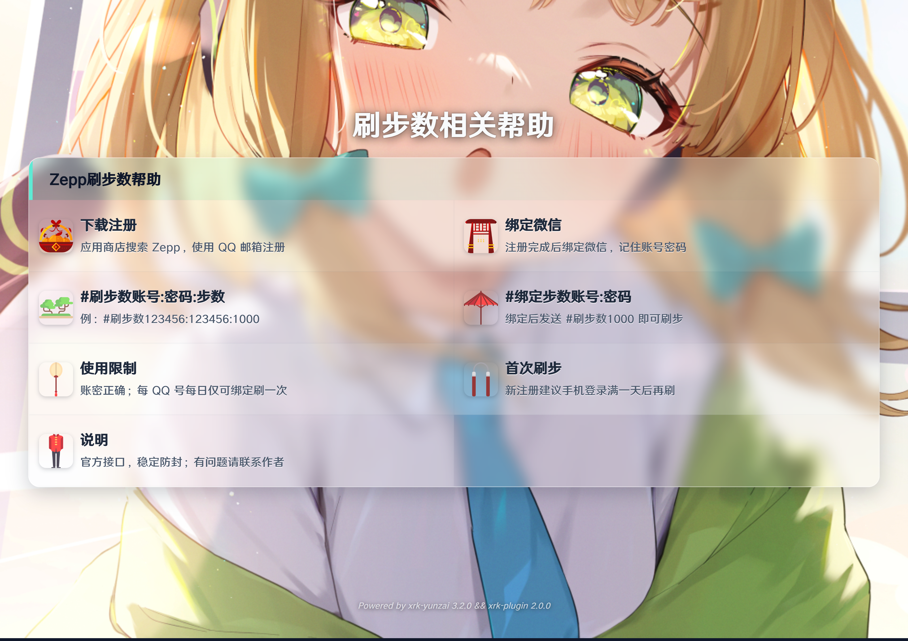
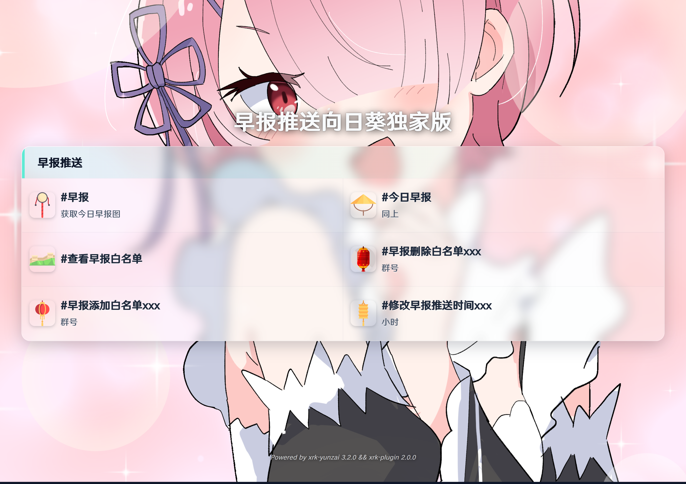
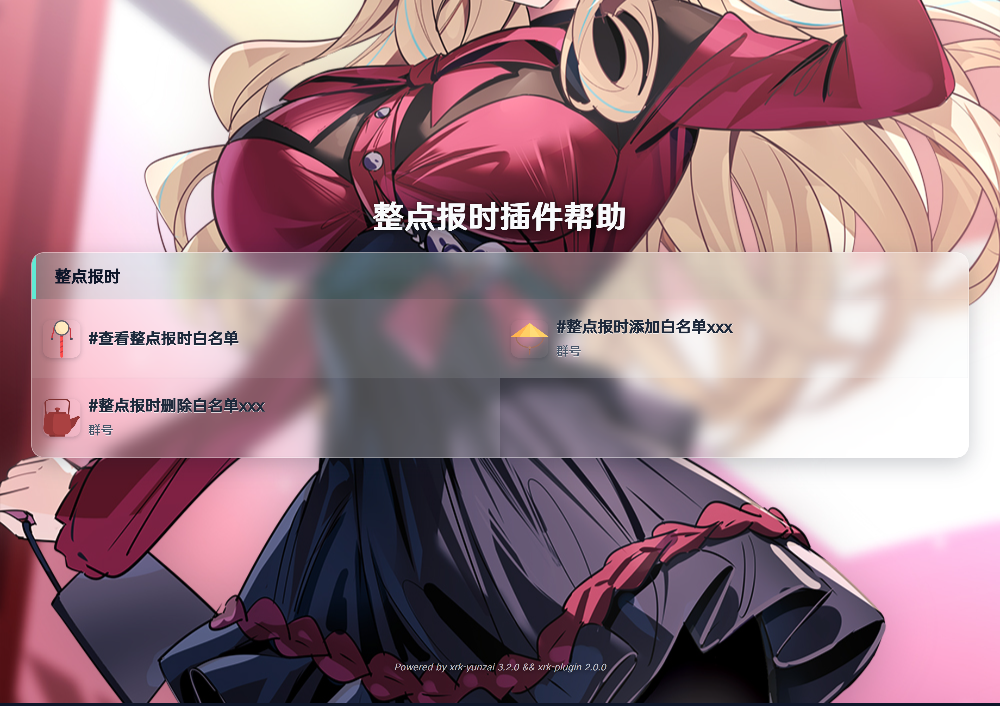
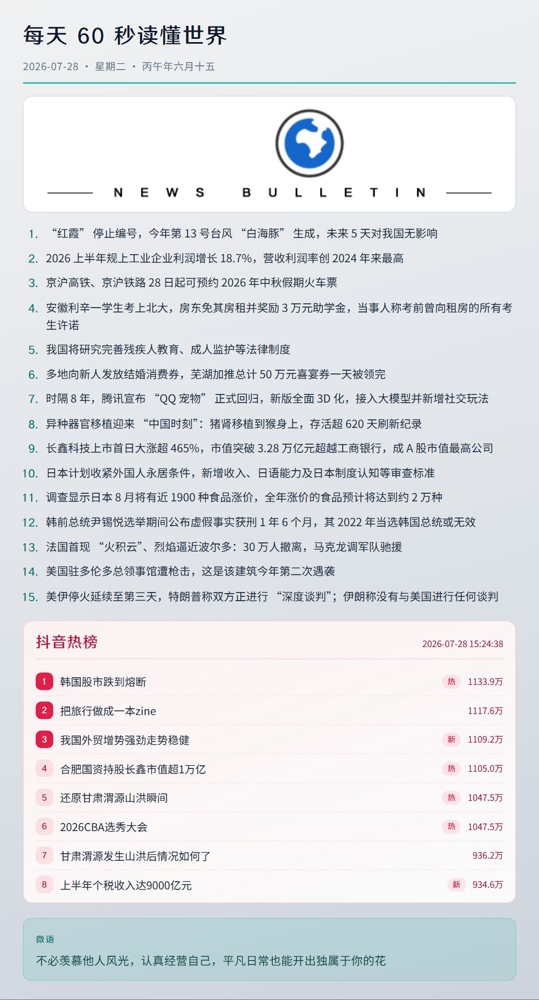

# 向日葵插件 · XRK-plugin

> 面向 [XRK-Yunzai](https://github.com/sunflowermm/XRK-Yunzai) 的多功能消息插件：帮助图、插件安装/管理、资源图、早报自渲、抖音热榜/推荐、整点报时等。


## 预览

入库预览图在 `assets/`（随仓库发布）。一行两张：

<p align="center">
  
  
</p>
<p align="center"><sub>左：主帮助　右：插件管理帮助（查/装/停用等）</sub></p>

<p align="center">
  
  
</p>
<p align="center"><sub>左：全局表情　右：刷步数</sub></p>

<p align="center">
  
  
</p>
<p align="center"><sub>左：早报推送帮助　右：整点报时</sub></p>

<p align="center">
  
  
</p>
<p align="center"><sub>左：主人管理　右：早报自渲示例</sub></p>

> `#安装插件列表` 运行时生成的分类截图在 `resources/plugins/*_group_*.png`，体积大且随列表变化，**已 gitignore，不入库**；插件管理说明见上方 `help-plugins.png`。

## 功能

- 帮助卡：主帮助 + 各子帮助页（表情 / 步数 / 早报 / 报时 / 插件 / 主人）
- 插件：查 / 装 / 删 / 启停；分类列表截图
- 资源图：随机图与关键词图（如东方、cos、黑丝等）
- 早报：拉取 JSON → 本地 HTML 截图；可定时推送白名单
- 抖音：热榜 / 推荐流 / 热词视频（复用 R Cookie；**链接解析请用 R**）
- 其它：全局表情、偷图、刷步数、整点报时、天气、群文件等

## 环境要求

- [XRK-Yunzai](https://github.com/sunflowermm/XRK-Yunzai)（Node.js 24+）
- 可选：已安装 [rconsole-plugin](https://gitee.com/kyrzy0416/rconsole-plugin) 并配置 `douyinCookie`（抖音热榜/推荐需要）

## 安装

将本仓库放到 Yunzai 的 `plugins/XRK-plugin/`，在框架根目录安装依赖后重启 Bot：

```bash
# 若为独立 clone
git clone <本仓库地址> plugins/XRK-plugin

# 框架根目录按需补依赖（见启动日志提示）
pnpm add axios uuid form-data node-schedule -w
```

## 常用指令

| 类别 | 指令 |
|------|------|
| 帮助 | `#向日葵帮助` · `#插件相关帮助` · `#早报推送帮助` · `#全局表情帮助` … |
| 插件 | `#查插件` · `#安装插件列表` · `#安装插件名` · `#停用插件` / `#启用插件` |
| 随机图 | `#随机图片` · `#东方图` · `#cos图` · `#黑丝图` … |
| 早报 | `#早报` · `#今日早报` · 白名单 / 推送时间相关指令 |
| 抖音 | `#抖音热榜` · `#抖音推荐` · `#抖音热词视频` |

完整条目以帮助图为准。

## 配置

| 路径 | 说明 | 是否入库 |
|------|------|----------|
| `config/default/*` | 默认模板（帮助列表、插件分类 JSON 等） | 是 |
| `data/xrkconfig/`（或端口目录） | 运行时用户配置（首次从 default 复制） | 否（本机） |
| `help_system.yaml` | 主帮助文案、`columnCount`、面板样式 | 模板在 default |
| `assets/*.png` | README / 文档用预览图 | **是** |
| `resources/help/` 模板与背景 | 帮助渲染资源 | 是（运行时生成的 html/css 除外） |
| `resources/plugins/*_group_*.png` | `#安装插件列表` 截图缓存 | **否**（gitignore） |
| R：`plugins/rconsole-plugin/config/tools.yaml` | `douyinCookie` | 属 R 仓库；勿把 Cookie 提交到公开仓 |

帮助背景映射：`lib/sub-help-pages.js` → `HELP_BACKGROUNDS` + `resources/help/bgother/`。

## 重新生成预览图

在 **XRK-Yunzai 仓库根目录**执行：

```bash
# 全部帮助预览 → assets/help-*.png
node plugins/XRK-plugin/scripts/render-help-preview.mjs

# 早报示例 → assets/morning-news.png
node plugins/XRK-plugin/scripts/render-morning-news-preview.mjs
```

## 目录结构

```
XRK-plugin/
├── apps/                 # 指令入口
├── lib/                  # 帮助渲染、插件列表、抖音、早报等
├── resources/help/       # 帮助模板、字体、背景
├── resources/plugins/    # 列表 HTML 模板；截图缓存不入库
├── assets/               # 入库预览 PNG
├── config/default/       # 默认配置模板
├── scripts/              # 预览渲染脚本
└── commonconfig/         # CommonConfig（若启用）
```

## License

[MIT](LICENSE) © Sunflower Studio
